# Examining the US Housing Market between 2003 and 2022
*Note:*
*If you are visiting from my CV, please reference `./classwork/Final-Report.Rmd` file to see my code and writing submissions or view the word document for the final report.*

## Table of Contents
1. [Introduction](#introduction)
2. [Data](#data)
3. [Exploration](#exploration)
5. [Modeling](#modeling)
     a. [Prediction](#prediction)
     b. [Clustering](#clustering)
6. [Dashboarding](#dashboarding)

  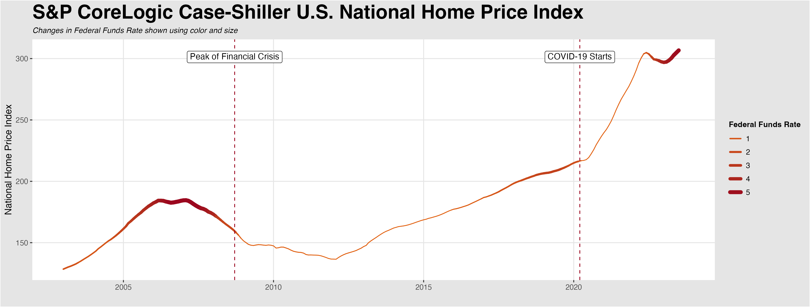

*The report uses different data than what is listed in this repository. I have done my best to recreate/improve upon the orginal data set using Kaggle. I will be working on separating the code to make the overall project more digestible.*

*Apologies for the incomplete README, I am in the process of improving upon the work in this repository!*

## Introduction

The current U.S. housing market is valued at 47 trillion USD (Rosen, 2023). Home ownership is a widespread aspiration, contributing to the ongoing growth of this market. Investors and economists rely on the Housing Price Index (HPI) as a crucial metric for assessing economic conditions. The HPI is a comprehensive macroeconomic measure that carefully monitors the price fluctuations of single-family homes nationwide. It also serves as an analytical tool for approximating the changes in the rates of mortgage defaults, prepayments, and housing affordability (Liberto, 2023). The Federal Housing Finance Agency compiles this data by reviewing single-family housing mortgages purchased or securitized by Fannie Mac or Freddie Mac. In this repo, I attempt to recreate the data set I used for the original project, organize, remake, and improve my modeling and visualizations, and elaborate on my learnings below. 

## Data

To recreate the data set I used for my final project, I used two data sets of hpi influences from kaggle. By comparing the values of variables between the two data sets and looking at the documentation of each, I chose only the variables whose values I could verify as accurate. I left joined on the each individual csv file on `house_data.csv`, because it only went back until 2003. The St. Louis Federal Reserve only reports real GDP on a quarterly basis, meaning the GDP column had missing values for 8 out of the 12 months for each year. I decided to use seasonal decomposition to impute the intermediate values. In this method, the time series is decomposed into its trend, and seasonal components; then, the intermediate values are imputed using only the trend; finally, the seasonality is added back into the data. This allows for imputed values that smoothly follow the trend of the time series while also adhering to any seasonality present. After renaming the remaining variables for ease of use, I extracted the month and year from the date features to use in my analyses before saving the data frame to `./data/modelling/` as `modelling.csv`. 

## Exploration

The raw code for my data exploration can be found in `./eda/viz-raw.R`. This R file contains the code for all visualization I have made/will make. Eventually, I would like to compartmentalize the code into separate notebooks, which each follow a specific narrative to highlight a particular part of the data. One of the first visualizations I created is shown below:

  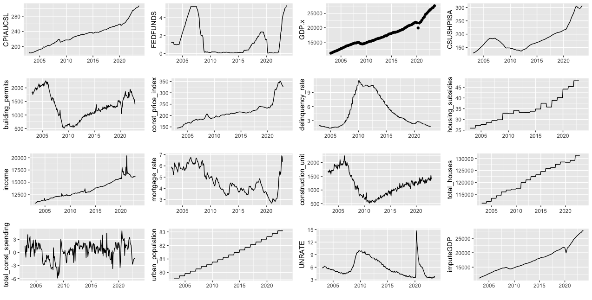

The above chart illustrates each numeric variable's trend over the dates in the data set. The next visualization I made was the following:

  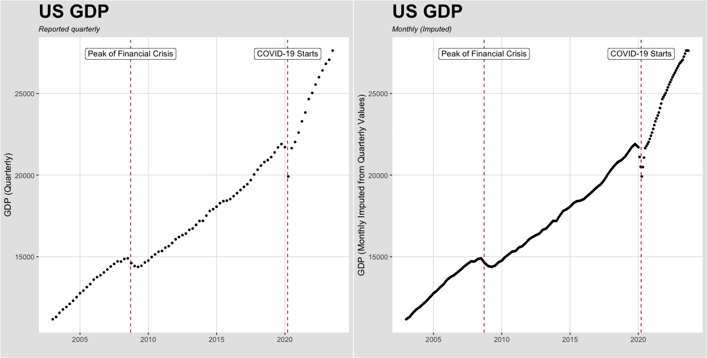

The above chart illustrates the quarterly GDP with a smoothing estimate overlay on the left and the imputed monthly GDP on the right. As can be seen in the chart, the seasonal decomposition imputation seems to match very well with the general trend of the quarterly GDPs. 

I also examined the Case-Shiller Housing Price Index over time and how it corresponded with the federal funds rate, a fundamental interest rate set by the federal reserve. 

  

I used color and size filters to create a dynamic line chart illustrating how fluctuations in hpi corresponded to increases/decreases in the federal funds rate. Some interesting points on the chart include around 2008 when the line risees sharply (HPI increases) while also becoming thicker and darker (federal funds rate increases). The same corresponding increases happen at the end of the chart as well.

Finally, I created a correlation matrix to illustrate how each numeric variable may be related to the housing price index. 

  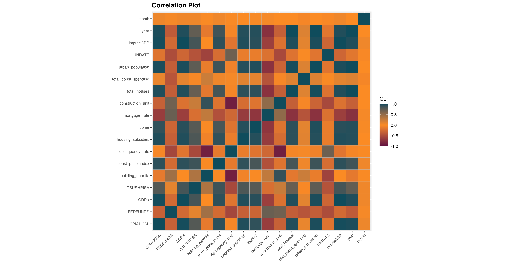

## Modeling
I created several models to predict the housing price index using my other explanatory variables. I mainly tested for predictive test accuracy; however, several of the models also reveal insights into important relationships between the explanatory variables and the housing price index. The models I created can be found in the `models` folder. Each file contains a different "type" of model (from linear regression through tuned random forests and clustering algorithms). I also created a K Means and PAM (Partitioning Around Medioids) algorithm to conduct a small post-hoc analysis. 

### Predictive Modeling

Below are the performance metrics from each model (*note: after the second entry, all models used ordinal year and month features*):

| Model | MSE | RMSE | MAE | MAPE |
|-------|-----|------|-----|------|
| Linear Regression (continuous year and month variables) | 29.31077 | 5.413942 | 4.159417 | 0.02270099 |
| Linear Regression (ordinal year and month variables) | 12.83391 | 3.582445 | 2.403261 | 0.0128168 |
| LASSO Regression | 6.810553 | 2.609704 | 1.897543 | 0.01043101 | 
| After LASSO OLS | 8.05126 | 2.837474 | 1.944628 | 0.01054192 |
| Ridge Regression | 9.822108 | 3.134024 | 2.127893 | 0.01157262 |
| Decision Tree (Pruned) | 59.4734 | 7.7119 | 6.289486 | 0.03404775 |
| Random Forest (Untuned) | 2.273641 | 1.50786 | 1.107139 | 0.006166471 |
| **Random Forest (Tuned with GridSearch)** | **2.228529** | **1.492826** | **1.09951** | **0.006213133** |

The table above highlights the incredible predictive power of the random forest algorithm. Even without any tuning, it outperforms our best performing linear model, indicating that there are likely some variables that have more than a simple linear relationship to the housing price index. Another interesting point is the improvement seen between the linear regression with ordinal year and month variables vs without. By making the year and month variables ordinal, we are encoding the relationship between, for example, December 2019 and January 2020. With this change, the model does not assume that 2003 is equally different to 2010 as 2024. 

The random forest models also allow us to plot nice variable importance charts, shown below: 

  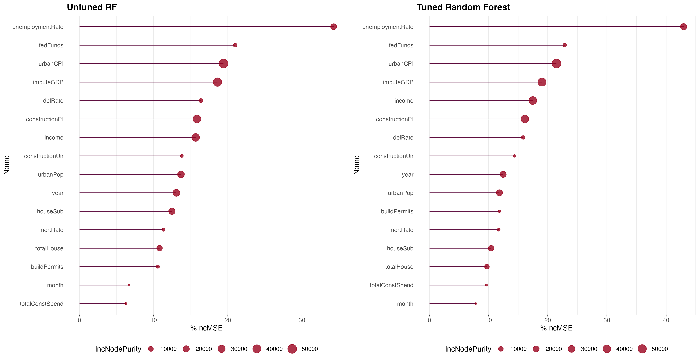

### Clustering
In addition to my predictive models, I ran two clustering algorithms, **K Means and Partitioning Around Medioids**. The k means algorithm's silhouette score indicated the optimal number of clusters to be 6: 

  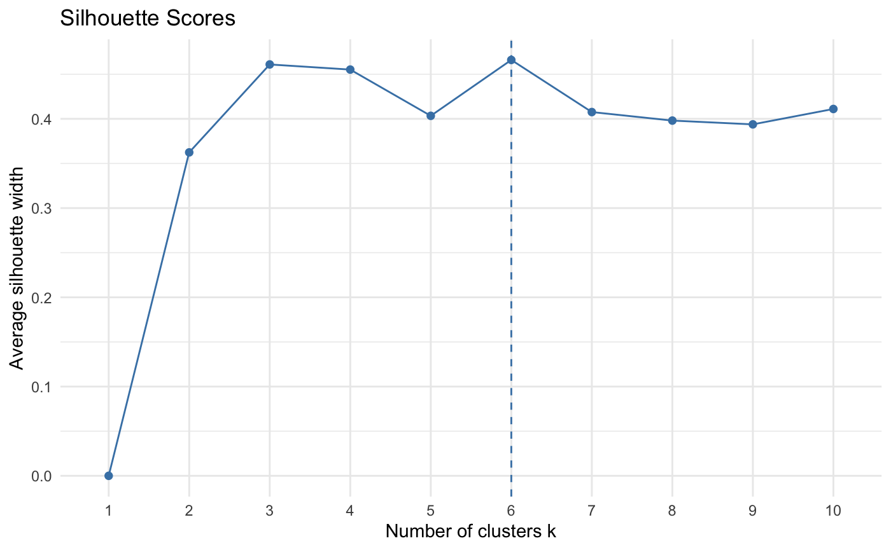

After generating the model, I visualized its clustering and compared the median housing price index across clusters. 

  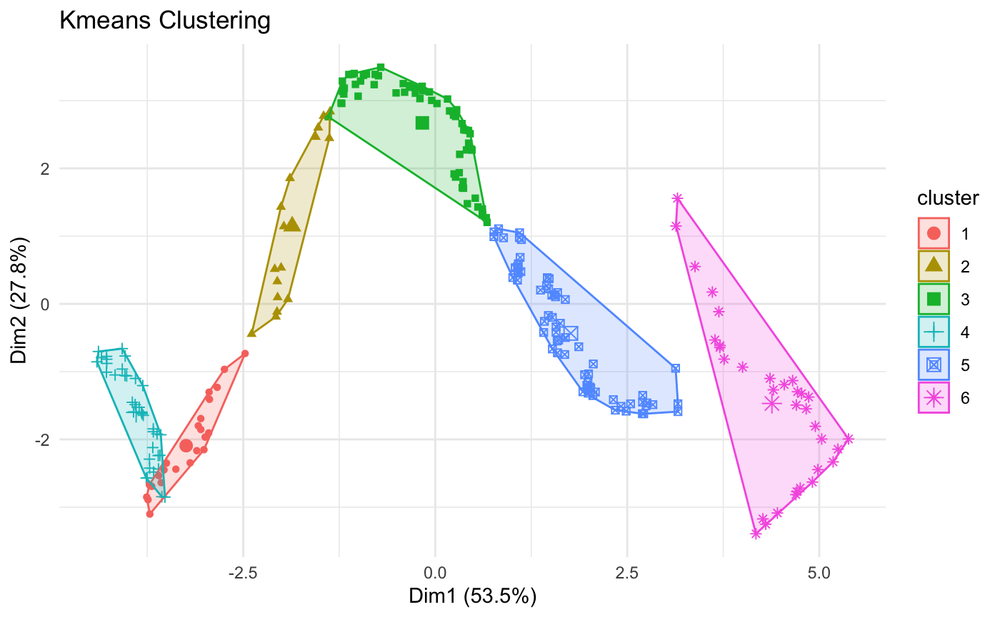

  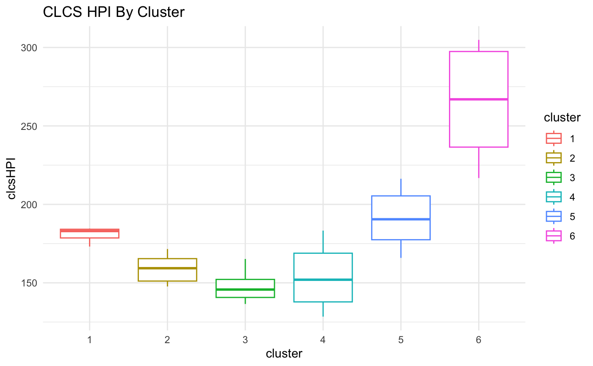

There are clearly some differences in median hpi across clusters, indicating that there may be some information there. In the future, it would be interesting to plot those clusters and housing price index values with some of the temporal variables in the data set. 

After the k means model, I repeated the same steps for the PAM model. The PAM algorithm's silhouette score indicated the optimal number of clusters to be 3:

  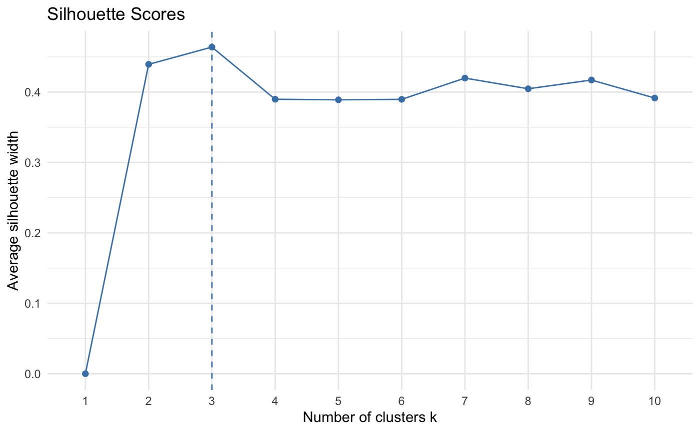

I then made the same visualizations as with the kmeans model. 

  

  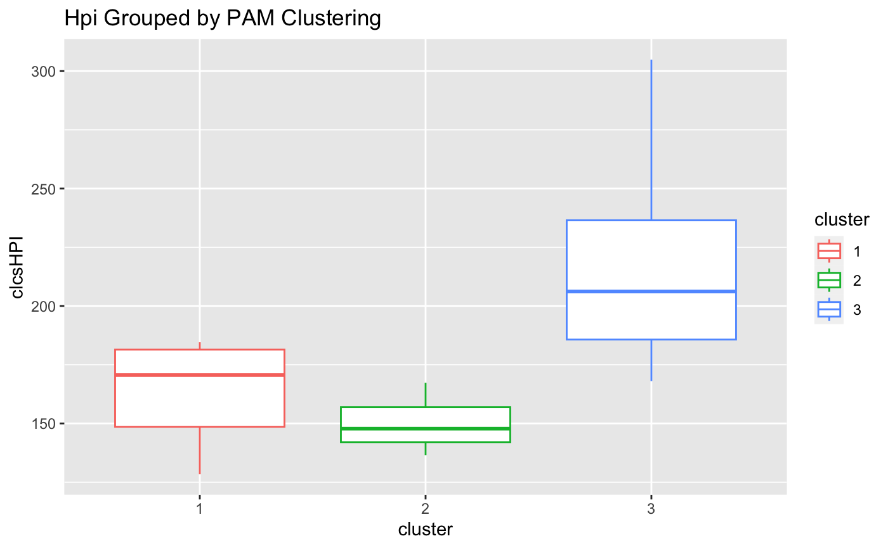

Again, there appears to be a noticeable difference in median hpi between clusters. 

## Dashboarding
Finally, to practice my shiny skills, I created a simple kmeans sandbox dashboard. In this dashboard, you can adjust the k value from 1 to 10 and watch how the clusters change and how the median hpi compares between clusters. 

  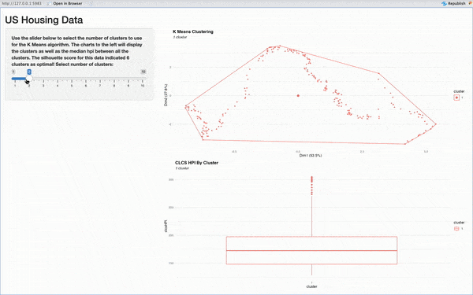

